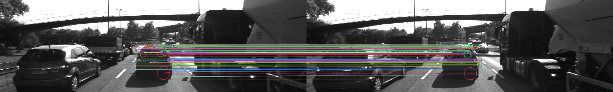

# SFND 2D Feature Tracking


The idea of the camera course is to build a collision detection system - that's the overall goal for the Final Project. As a preparation for this, you will now build the feature tracking part and test various detector / descriptor combinations to see which ones perform best. This mid-term project consists of four parts:

* First, you will focus on loading images, setting up data structures and putting everything into a ring buffer to optimize memory load. 
* Then, you will integrate several keypoint detectors such as HARRIS, FAST, BRISK and SIFT and compare them with regard to number of keypoints and speed. 
* In the next part, you will then focus on descriptor extraction and matching using brute force and also the FLANN approach we discussed in the previous lesson. 
* In the last part, once the code framework is complete, you will test the various algorithms in different combinations and compare them with regard to some performance measures. 

See the classroom instruction and code comments for more details on each of these parts. Once you are finished with this project, the keypoint matching part will be set up and you can proceed to the next lesson, where the focus is on integrating Lidar points and on object detection using deep-learning. 

## Dependencies for Running Locally
* cmake >= 2.8
  * All OSes: [click here for installation instructions](https://cmake.org/install/)
* make >= 4.1 (Linux, Mac), 3.81 (Windows)
  * Linux: make is installed by default on most Linux distros
  * Mac: [install Xcode command line tools to get make](https://developer.apple.com/xcode/features/)
  * Windows: [Click here for installation instructions](http://gnuwin32.sourceforge.net/packages/make.htm)
* OpenCV >= 4.1
  * This must be compiled from source using the `-D OPENCV_ENABLE_NONFREE=ON` cmake flag for testing the SIFT and SURF detectors.
  * The OpenCV 4.1.0 source code can be found [here](https://github.com/opencv/opencv/tree/4.1.0)
* gcc/g++ >= 5.4
  * Linux: gcc / g++ is installed by default on most Linux distros
  * Mac: same deal as make - [install Xcode command line tools](https://developer.apple.com/xcode/features/)
  * Windows: recommend using [MinGW](http://www.mingw.org/)

## Basic Build Instructions

1. Clone this repo.
2. Make a build directory in the top level directory: `mkdir build && cd build`
3. Compile: `cmake .. && make`
4. Run it: `./2D_feature_tracking`.

## Comparison of Detector/Descriptor Combinations

All the results have been logged [here](./output). Please feel free to check on those results (MP7 to MP9). The top3 combination would be FAST/BRIEF, FAST/BRISK, and FAST/ORB. The following ones are ORB/BRISK and ORB/BRIEF. These combination proecess the image in less than 15ms, and could be as fast as in 5ms. I think those combination can be used in real-time detection.

## MP.0 Mid-Term Report
The write-up is incorporated into this README file.<br>

## MP.1 Data Buffer Optimization
Using the below code I can keep our databuffer's elements less or equal to 2.
```c++
if (dataBuffer.size() > dataBufferSize)
        {
            dataBuffer.erase(dataBuffer.begin());
        }
```

## MP.2 Keypoint Detection
I add I/O function for the users to choose detector type from HARRIS, FAST, BRISK, ORB, AKAZE, and SIFT. Once we run the executable, we can type in the detector name we want to use.

## MP.3 Keypoint Removal
We create a  rectangle region in the processed image, and the keypoints beyond this region would be removed.
```c++
bool bFocusOnVehicle = true;
        cv::Rect vehicleRect(535, 180, 180, 150);
        if (bFocusOnVehicle)
        {
            for (auto it = keypoints.begin(); it != keypoints.end();)
            {
                if (it->pt.x < vehicleRect.x || it->pt.x > (vehicleRect.x + vehicleRect.width) || it->pt.y < vehicleRect.y || it->pt.y > (vehicleRect.y + vehicleRect.height))
                {
                    it = keypoints.erase(it);
                }
                else
                {
                    ++it;
                }
            }
        }
```

## MP.4 Keypoint Descriptors
A I/O function has been added for the users to choose descriptor type from BRIEF, ORB, FREAK, AKAZE and SIFT. We can type in the descriptor name we want to use by following the instruction gievn by the executable.

## MP.5 Descriptor Matching
FLANN (Fast Library for Approximate Nearest Neighbors) and BF (Brute-force) matching can be selected following the instruction provided by the executable.

## MP.6 Descriptor Distance Ratio
As shown below, we can modify the *minDescDistRatio* to decide whether we should keep a matching pair.
```C++
double minDescDistRatio = 0.8;
        for (auto it = knn_matches.begin(); it != knn_matches.end(); ++it)
        {

            if ((*it)[0].distance < minDescDistRatio * (*it)[1].distance)
            {
                matches.push_back((*it)[0]);
            }
        }
```

## MP.7 Performance Evaluation 1
Count the number of keypoints on the preceding vehicle for all 10 images and take note of the distribution of their neighborhood size.<br>

I implement a I/O function in the codes to automatically log those information into a file [here](./output/MP7keypoints.csv).

## MP.8 Performance Evaluation 2
## MP.9 Performance Evaluation 3
Count the number of matched keypoints for all 10 images using all possible combinations of detectors and descriptors. In the matching step, the BF approach is used with the descriptor distance ratio set to 0.8.<br>

Log the time it takes for keypoint detection and descriptor extraction.<br>
The above info will be automatically logged onto a [output file](./output/MP89matching.csv).<br>

As mentioned in the Comparison of Detector/Descriptor Combinations part. The top3 combination would be FAST/BRIEF, FAST/BRISK, and FAST/ORB. The following ones are ORB/BRISK and ORB/BRIEF. These combination proecess the image in less than 15ms, and could be as fast as in 5ms. I think those combination can be used in real-time detection.

Below is a keypoints matching scenario:

